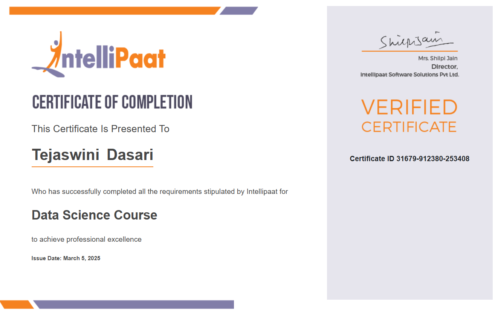

# Business Analyst
Technical Skills: SQL Server, Power BI, Python, Machine Learning, Artificial Intelligence 
 
### Education
#### Executive Post Graduate: 
Pursuing Executive Post Graduate Program in Data Science and Artificial Intelligence from Intellipaat
#### Graduation: 
##### Bachelor of Technology (B. Tech) in Information Technology
CMR Technical Campus | Year of Graduation: [2023]
##### Intermediate:
Math, Physics, Chemistry | Sri Gayatri Junior College [2019]

### Internship Experience
##### Cognizant Technology Solutions | .Net Developer [2023]
* Worked as an Intern in Web Development Domain for 5 months
* Gained knowledge on programming languages like C#, HTML, CSS, JavaScript.
* Got familiarized with the professional work environment

### Certifications

### Academic Projects
##### Chronic Kidney Disease Prediction Using Machine Learning
* Gathered datasets containing patients health reports
* Cleaned the data and made predictions using Machine Learning algorithms like Random Forest CLassifier, Decision Tree.
* Used various python libraries for analysis and visualization including Pandas, Matplotlib.

##### Life Expectancy Prediction using Machine Learning
* Collected the datasets from survey reports and medical reports
* Cleaned and analyzed the data using Python and Machine Learning concepts like Support Vector Machine Algorithm, Numpy Library, Seaborn Library, Decision Tree classifiers.

